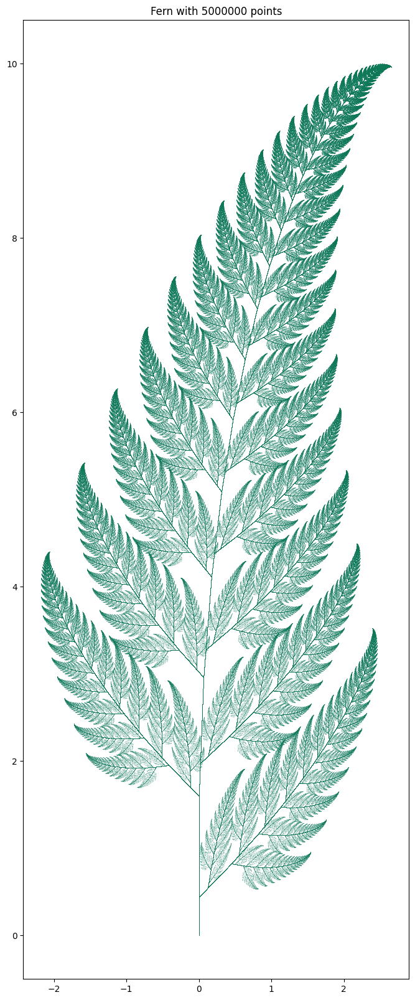
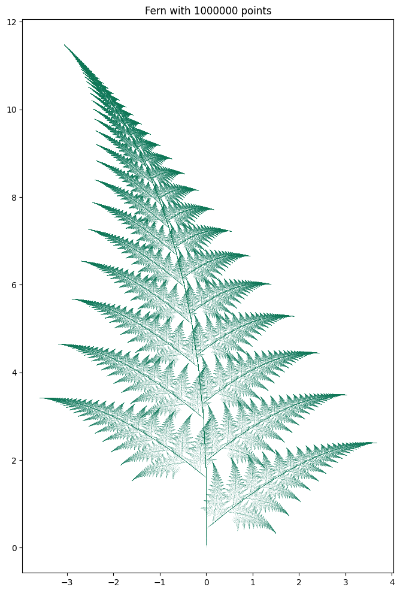
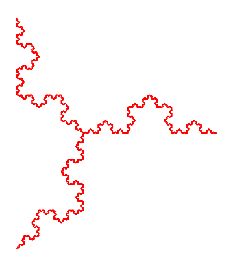
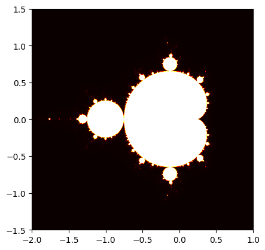

# Alpine_Transformations
Code which can create high quality alpine ferns like Barnsley as well as some other cool fractals like the tree of snowflake.

Alpine transformation inputs according to https://en.wikipedia.org/wiki/Barnsley_fern. 

Produces images such as:

And other variants like:

As well as other fractals such as the tree, snowflake, or even the mandelbol set.

